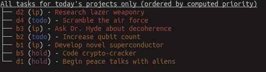
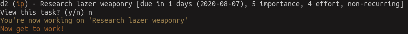
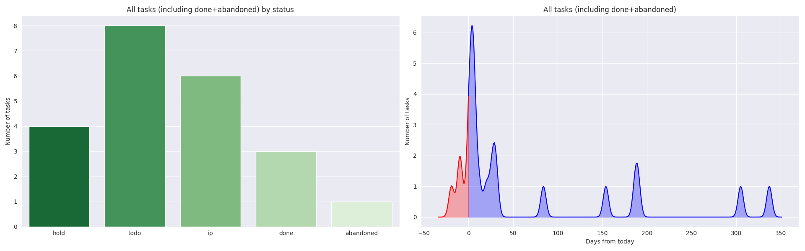
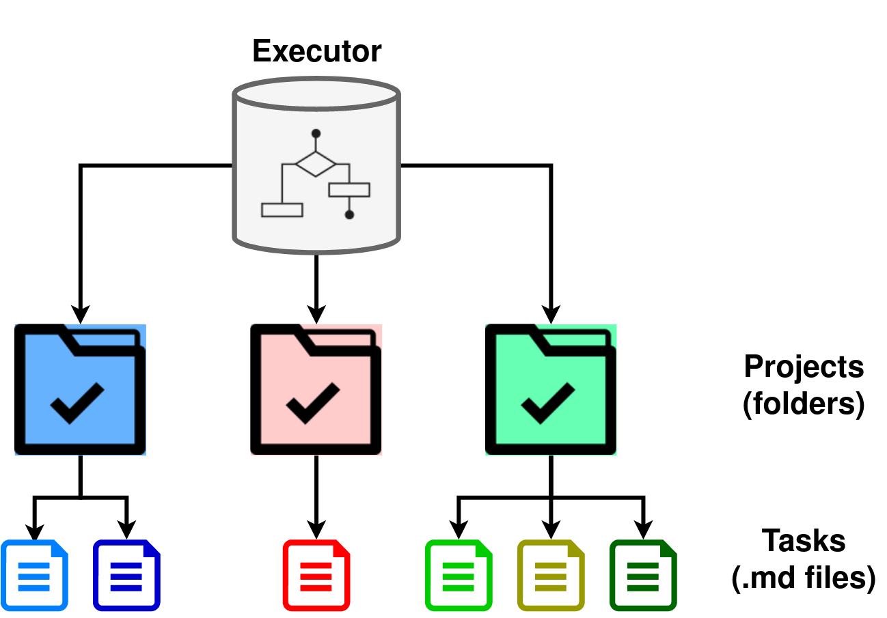

# Day executor (`dex`)

| Tests | Release |
|:-------:|:-------:|
|| Coming soon! |

#### `dex` is an ultra-minimal and opinionated productivity system (and CLI tool). Use it to get more done in less time with less organization overhead.
`dex` is an out-of-the-box usable, optionally programmatic, kanban-ish FOSS productivity CLI which you have absolute control over. 
Keep your tasks as local markdown files and `dex` will tell you how to optimally execute them. 


###### Dex Jettster from "*Star Wars: Attack of the Clones*", who helps Obi-wan prioritize his time searching for a poison dart. Fortunately, the commonalities between `dex` and Dex end there.

# Is `dex` for me?
#### Take this quiz.

1. Are you tired of trying many "productivity" tools, only to find you spend more time organizing your tasks than you do completing them?
2. Are you worried if you move from Productivity Service #1 to Productivity Service #2 you will lose/have to re-enter all your project and task info?
3. Do you like managing things with simple files (such as markdown) rather than online or through an app?
4. Do you find yourself spending too much time figuring out what to work on or stressing about everything you have to do?
5. Do you like the command line?

**If you answered "yes" to three or more of these questions, `dex` is for you. Otherwise, move on.**


# Highlights
##### View tasks across all projects, ordered intelligently by priority

`$: dex tasks`


A little less detail

`$: dex tasks -h -n 7`




---

##### View tasks by project

`$: dex tasks -p`


---

##### Intelligently and automatically determine what to work on, according to a weekly schedule
`$: dex exec`



---

##### Get a visual overview
`$: dex info -v`


`$ dex info -v -i`


```
The current dex working directory is '/home/dude/down/project_example'
There are currently 5 projects.
There are currently 7 active tasks for today's projects.
There are currently 10 tasks for today's projects, including done and abandoned.
There are currently 18 active tasks for all projects.
There are currently 22 tasks for all projects, including done and abandoned.
```

---

##### Your tasks are markdown files which can be edited or linked however you like, including via:
- Tools like [Obsidian](https://obsidian.md) and [Atom](https://atom.io)
- Basic text editors, such as `vim` or `nano`
- `dex` CLI

```
$: tree
.
├── Build new house
│   ├── notes
│   └── tasks
│       ├── abandoned+done
│       ├── Call Tyler and sketch floorplan.md
│       ├── Get price quote from auditor.md
│       ├── Negotiate contract with subcontractor.md
│       └── Pour concrete in basement.md
├── Create quantum computer
│   ├── notes
│   └── tasks
│       ├── abandoned+done
│       ├── Ask Dr. Hyde about decoherence.md
│       ├── Code crypto-cracker.md
│       ├── Develop novel superconductor.md
│       └── Increase qubit count.md
├── Cure COVID-19
│   ├── notes
│   └── tasks
│       ├── abandoned+done
│       ├── Find adequate host cells.md
│       ├── Get FDA Approval.md
│       ├── Research literature on vaccines.md
│       └── work out manufacturing contract.md
...

```


# The System



#### Tasks (units of work)

Tasks are non-trivial, self-contained units of work. They are individual markdown files. The file name is the name of the task; the contents are whatever you want them to be (notes, subtasks, nothing, etc.).

##### Tasks have the following attributes:

- **Status**: Todo, In progress (IP), On hold, Done, and Abandoned
- **Effort**: How much effort (approximately) the task will take to complete (a number, 1-5)
- **Importance**: How important the task is (a number, 1-5). Effort of 5 might be something that could get you promoted (or fired!), while effort of 1 has almost no consequences.
- **Due date**: Day when the task is due.


#### Projects (collection of tasks)

Projects are long-standing collections of tasks. Projects are folders. Besides containing the task markdown files, the project can contain whatever you want (e.g., dedicated notes folder, code subfolders, etc.). I just have a notes subfolder but it can be whatever you want.


#### Executor (schedule of projects)

The executor is your entire set of projects defined on a weekly basis; you can work on one or more projects per day. For example, you work on Projects A and B on MWF, and Project C on Tuesday/Thursday, with Projects D and E on weekends. Or you can work on every project every day; it's really up to you.

#### Work

`dex`'s system for choosing tasks is built on a few core assumptions:

1. Choosing what to work on is hard, especially when you have many projects and tasks.
2. Your time is best spent working on one task (or group of highly related tasks) until it is done, rather than skipping between tasks (AKA "deep work")
3. Tasks have higher and lower priorities (based on status, effort, importance, and due date), meaning some need to be done before others.

`dex` uses these heuristics to determine the optimal way to execute your tasks.

The idea is that all the human effort required to prioritize work is done when you enter new tasks, and `dex` handles the rest on a daily basis.


# Installation
For now, clone the repo and install via pip:
```bash
$: git clone https://github.com/ardunn/dex
$: cd dex
$: pip install . -r requirements.txt --user
```


Coming soon, once some kinks are worked out: PyPi install!

# Usage


## Basics

#### Make an example:
```buildoutcfg
$: dex example /path/to/my/example
```

#### Initiate dex in an existing folder 
```buildoutcfg
$: dex init /path/to/my/example
```

#### View, edit, or make a new project
Projects are identified with a single alphabetic character
```buildoutcfg
$: dex project a               # view project a
$: dex project a rename        # rename project a
$: dex project new             # make a new project
```

#### View, edit, or make a new task
Tasks are identified by their dex ID (project ID + a number)
```
$: dex task a1                  # view task a1
$: dex task a1 edit             # edit the content of task a1
$: dex task new                 # make a new task
```

#### Complete or change tasks' statuses
```buildoutcfg
$: dex task a1 done             # complete task a1
$: dex task b7 todo             # mark task b7 as todo
$: dex task c11 aban            # abandon task c11
```


## List of all commands


```bash
# Top level commands
--------------------
dex init [path]                                     # create a new executor file and save the path somewhere
dex exec                                            # print and start work on the highest importance task, printing all info
dex info                                            # output some info about the current projects
dex example [path]                                  # create an example directory


# Executor commands
-------------------
dex executor                                        # view weekly schedule
dex executor edit                                   # edit the schedule file


# Project commands
-------------------
dex projects
dex project new                                     # make a new project
dex project [id]                                    # show all tasks for this project, ordered by priority             
dex project [id] exec                               # work on this specific project (not recommended)
dex project [id] rename                             # rename a project
dex project [id] rm                                 # delete a project


# Task commands
-------------------
dex tasks                                           # view ordered tasks across projects (default relevant to today, ordered by computed priority)
    Filtering (exclusive) options
    (--by-importance/-i)                            # Tasks ranked strictly by importance
    (--by-effort/-e)                                # Tasks ranked strictly by effort
    (--by-due/-d)                                   # Tasks ranked strictly by due date
    (--by-status/-s)                                # Tasks organized by status, ranked internally by computed priority
    (--by-project/-p)                               # Tasks organized by project, ranked internally by computed priority
    
    Additional options
    (--n-shown/-n [val])                            # limit to this number of total tasks shown
    (--all-projects/-a)                             # show across all projects, not just today
    (--include-inactive)                            # show inactive (done+abandoned) tasks
    
dex task                                            # make a new task
dex task [dexid]                                    # view a task
dex task [dexid] edit                               # edit a task
dex task [dexid] rename                             # rename a task
    
dex task [dexid] set ...                            # set an attribute of a task
    (--importance/-i [val]) 
    (--efort/-e [val]) 
    (--due/-d [val) 
    (--status/-s [status])
    (--recurring/-r [days])


# Task aliases (all shorthand for dex task [dexid] set)
-------------------------------------------------------
dex task [dexid] imp [val]                          # set the importance of the task to [val]
dex task [dexid] eff [val]                          # set the effort of the task to [val]
dex task [dexid] due [val]                          # set the due date/recurrence of the task 
    (--recurring/-r [days])

dex task [dexid] exec                               # manually set a task to in progress
dex task [dexid] done                               # complete a task
dex task [dexid] todo                               # mark a task as todo
dex task [dexid] hold                               # put a task on hold
dex task [dexid] aban                               # abandon a task
```
