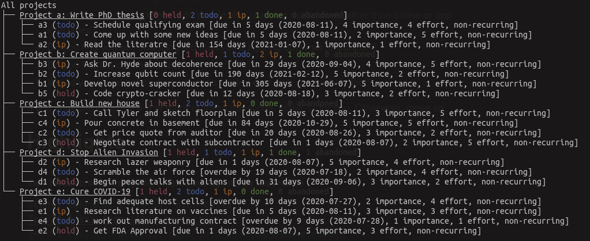
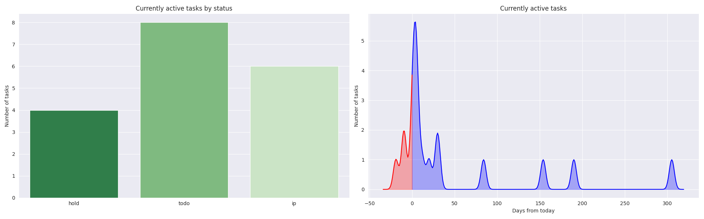

# `dion` - a productivity system

#### dion is an ultra-minimal and opinionated productivity system (and CLI tool).
It tells you what to work on and when. You can also create, edit, and view tasks. Use `dion` to get more done in less time with less organization overhead.


###### `dion` is named after the Greek god of fertility and productivity, Dionysus.

# Is `dion` for me?
### Take this quiz.

1. Are you tired of trying many "productivity" tools, only to find you spend more time organizing your tasks than you do completing them?
2. Are you worried if you move from Productivity Service #1 to Productivity Service #2 you will lose/have to re-enter all your project and task info?
3. Do you like managing things with simple files (such as markdown) rather than online or app interfaces?
4. Do you find yourself spending too much time figuring out what to work on?
5. Do you like the command line?

If you answered "yes" to 3 or more of these questions, `dion` is for you. Otherwise, move on.


# Highlights
##### View tasks across all projects, ordered intelligently by importance


---

##### View tasks by project


---

##### Intelligently and automatically determine what to work on, according to a weekly schedule


---

##### Get an overview



---

##### Your tasks are markdown files which can be edited however you like (or via `dion` CLI)


## The System
#### Tasks

Tasks are non-trivial, self-contained units of work. They are individual markdown files. The file name is the name of the task; the contents are whatever you want them to be (notes, subtasks, nothing, etc.).

Tasks have both a **status** (todo, doing, on hold, done) and a **priority** (1-3, lower is more important).

#### Projects

Projects are long-standing collections of tasks. Projects are folders. Besides containing the task markdown files, the project can contain whatever you want (e.g., dedicated notes folder, code subfolders, etc.). I just have a notes subfolder but it can be whatever you want.

Using these heuristics and your project schedule, `dion` can tell you which tasks (Markdown files) and Projects (folders of tasks) to work on. `dion` works best when you define tasks which require approximately equal time.

#### Schedule

A schedule is your entire set of projects. Your schedule is defined weekly; you can work on one or more projects per day. For example, you work on Projects A and B on MWF, and Project C on Tuesday/Thursday, with Projects D and E on weekends. Your schedule is defined in a single json file in a folder containing your dion project folders.


#### Work

`dion`'s system for choosing work tasks is built on a few core assumptions:

1. Choosing what to work on is hard, especially when you have many projects and tasks.
2. Your time is best spent working on one task (or group of highly related tasks) until it is done, rather than skipping between tasks (AKA "deep work")
3. Tasks have higher and lower priorities, meaning some need to be done before others.

Based on your schedule, dion ranks tasks based on the priorities and statuses (among other attributes) of all available tasks.
The idea is that all the human effort required to prioritize work is done when you enter new tasks, and dion handles the rest on a daily basis.


# Installation
For now, clone the repo and install via pip:
```bash
$: git clone https://github.com/ardunn/dion
$: cd dion
$: pip install . -r requirements.txt --user
```


Coming soon, once some kinks are worked out: PyPi install!

# Usage


### Basics

First, initialize an example to work with:

```bash
$: dion example ~/Downloads/productivity_system  # creates some example files in your favorite directory
$: dion init ~/Downloads/productivity_system     # creates a new dionysus root.
```

Get an overview of current projects:

```bash
$: dion projects
```

```bash
All projects
├── Project a: Cure COVID-19 [2 todo, 0 doing, 1 held, 1 done]
├── Project b: Destroy Aliens [2 todo, 1 doing, 0 held, 0 done]
└── Project c: Create quantum computer [1 todo, 1 doing, 1 held, 0 done]
```

Projects in `dion` can be accessed through their *project id*, a single letter.

Now get an overview of tasks for each project.

```bash
$: dion tasks -n 3 --by-project
```

```bash
All projects
├── Project a: Cure COVID-19 [2 todo, 0 doing, 1 held, 1 done]
│   ├── a3 (todo) [prio=1]: Use NLP to scan literature
│   ├── a4 (todo) [prio=2]: Learn biology
│   └── a2 (hold) [prio=2]: Create vaccine
├── Project b: Destroy Aliens [2 todo, 1 doing, 0 held, 0 done]
│   ├── b3 (todo) [prio=1]: Commission laser weapon
│   ├── b2 (todo) [prio=2]: Invent warp drive
│   └── b1 (doing) [prio=3]: try to make peace
└── Project c: Create quantum computer [1 todo, 1 doing, 1 held, 0 done]
    ├── c1 (doing) [prio=1]: Look into quantum entanglement
    ├── c3 (todo) [prio=2]: Get liquid nitrogen
    └── c2 (hold) [prio=3]: get funding
```

Tasks are accessible by their *task id*, the project letter followed by an integer (e.g., `a1`)

View all tasks together:
```bash
$: dion tasks
```

```bash
Top 10 tasks from all 3 projects:
├── b2 (doing) [prio=1]: Commission laser weapon
├── d1 (doing) [prio=1]: Look into quantum entanglement
├── a3 (todo) [prio=1]: Use NLP to scan literature
├── a4 (todo) [prio=2]: Learn biology
├── b4 (todo) [prio=2]: Invent warp drive
├── d3 (todo) [prio=2]: Get liquid nitrogen
├── b1 (doing) [prio=3]: try to make peace
├── a2 (hold) [prio=2]: Create vaccine
└── d2 (hold) [prio=3]: get funding
```

Start work:
```bash
$: dion work
```

```bash
Task c1: Look into quantum entanglement
View this task? (y/n) n
You're now working on 'Look into quantum entanglement'
Now get to work!
```

### Tasks

Adding a task:
```bash
$: dion task new
```

```bash
Select a project id from the following projects:
------------------------------------------------
All projects
├── Project a: Cure COVID-19 [2 todo, 0 doing, 1 held, 1 done]
├── Project b: Destroy Aliens [2 todo, 1 doing, 0 held, 0 done]
└── Project c: Create quantum computer [1 todo, 1 doing, 1 held, 0 done]

Project ID: b
Enter a name for this task: Infiltrate mothership 
Enter the task's priority (1 - 3, lower is more important): 2
Enter the task's status (one of ('todo', 'doing', 'hold', 'done'), or hit enter to mark as todo: doing
Edit the task's content? (y/n) n

----------------------------------------------------------------------------
Task b4: 'Infiltrate mothership' created with priority 2 and status 'doing'.
```

Change the status of an existing task
```bash
$: dion task b4 done  # complete a task
```
or
```bash
$: dion task b4 hold  # put a task on hold
```
or
```bash
$: dion task b4 todo  # mark a task as todo
``` 
or
```bash
$: dion task b4 work # not recommended, manually set a given task as doing
```

Change a task priority
```bash
$: dion task a1 prio 3
```

View a task
```bash
$: dion task a1 view
```

```bash
Get funding: (done) [prio=1]

Need to get funding
    - Ask federal government?
    - Ask state government?
    - Consider private industries
  Important: tell them u know python

```

Edit a task
```bash
$: dion task b2 edit
```

Rename a task
```bash
$: dion task b2 rename
```

### Projects

Adding a project
```bash
$: dion project new
```

```bash
Project `Cool new project` added.
All projects
├── Project a: Cure COVID-19 [2 todo, 0 doing, 1 held, 1 done]
├── Project b: Destroy Aliens [2 todo, 2 doing, 0 held, 0 done]
├── Project c: Cool new project [0 todo, 0 doing, 0 held, 0 done]
└── Project d: Create quantum computer [1 todo, 1 doing, 1 held, 0 done]
```

View a single project
```bash
$: dion project b view
```

```bash
All projects
└── Project b: Destroy Aliens [2 todo, 2 doing, 0 held, 0 done]
    ├── b4 (todo) [prio=1]: Commission laser weapon
    ├── b2 (doing) [prio=2]: Infiltrate mothership
    ├── b3 (todo) [prio=2]: Invent warp drive
    └── b1 (doing) [prio=3]: try to make peace
```

Work on a given project, with task selected by algorithm constrained to this project's tasks
```bash
$: dion project b work
```

```bash
Task b4: Commission laser weapon
View this task? (y/n) n
You're now working on 'Commission laser weapon'
Now get to work!
```

Change all priorities of a project's tasks
```bash
$: dion project b prio 1
```


Rename a project
```bash
$: dion project b rename
```

Remove a project
```bash
$: dion project b rm
```

### Schedule
View weekly schedule
```bash
$: dion schedule
```

```bash
Schedule
├── Monday
│   ├── Cure COVID-19
│   ├── Destroy Aliens
│   ├── Cool new project
│   └── Create quantum computer
...
└── Sunday
    ├── Cure COVID-19
    ├── Destroy Aliens
    ├── Cool new project
    └── Create quantum computer

```

Edit weekly schedule
```bash
$: dion schedule edit
```

### Other
Get info about all projects
```bash
$: dion info -v
```